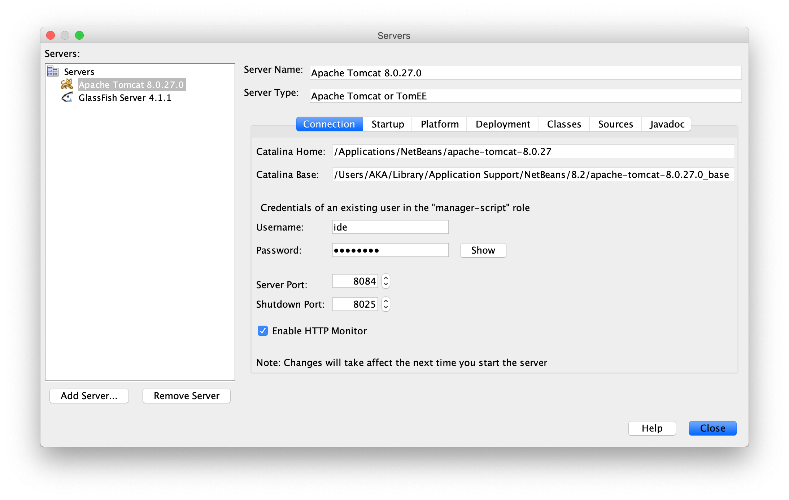

# Examples of BASIC and FORM authentication

To make the examples work the `tomcat-users.xml` file must contain users and roles.

```
<?xml version='1.0' encoding='utf-8'?>
<tomcat-users xmlns="http://tomcat.apache.org/xml"
    xmlns:xsi="http://www.w3.org/2001/XMLSchema-instance"
    xsi:schemaLocation="http://tomcat.apache.org/xml tomcat-users.xsd"
    version="1.0">
  <role rolename="khalisi"/>
  <role rolename="slave"/>
  <user username="denaries" password="dragon" roles="khalisi"/>
  <user username="kurt" password="tomcat" roles="slave"/>
  <user username="lars" password="tomcat" roles="slave"/>
  <user username="ide" ... />
</tomcat-users>
```

You can find the path to the file in `Catalina Base`:


